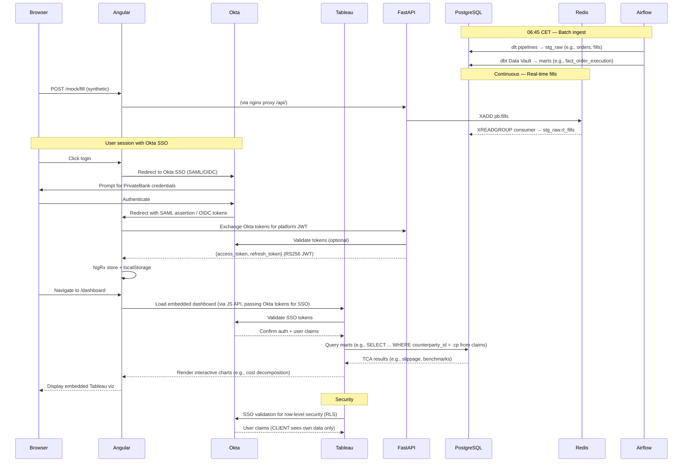

# README_EXTRA — Sections Not Implemented

This file contains architecture sections and design alternatives that are **not implemented** in the current codebase. They are preserved here as reference for future work.

---

## Component Interactions with Embedded Tableau (Alternative Version)

This alternative version incorporates Okta SSO for unified authentication across PrivateBank's ecosystem, with Tableau embedded in the Angular SPA using Okta tokens for secure access. It connects directly to PostgreSQL for TCA data visualization, maintaining RBAC via Okta claims and data isolation. Embedding uses Tableau's JS API with Okta SSO for seamless integration.
