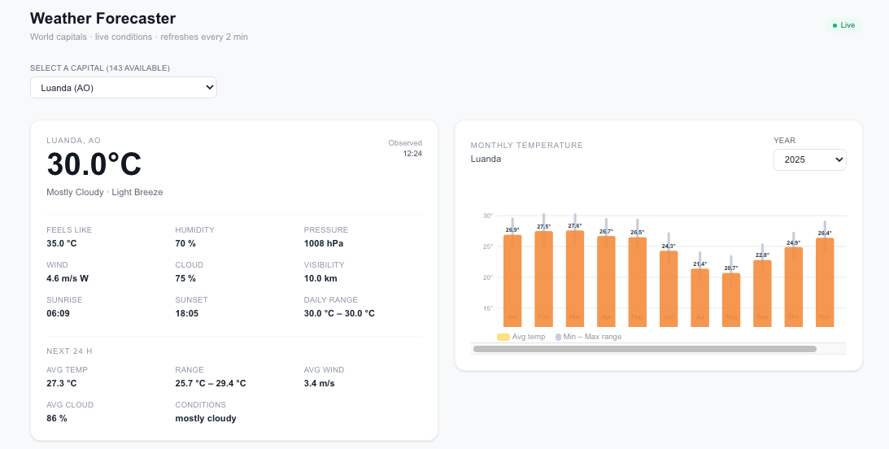
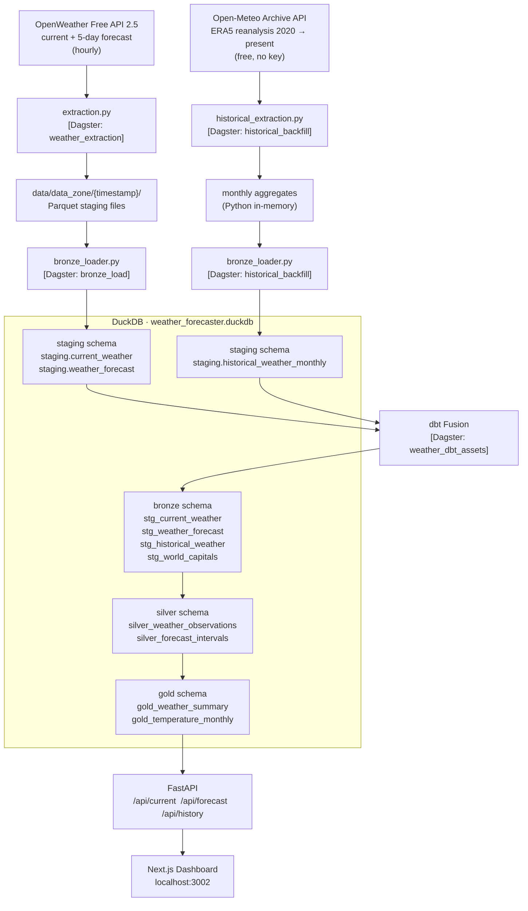

# Weather Forecaster

A data engineering pipeline that extracts weather data from the [OpenWeather Free API 2.5](https://openweathermap.org/api) and loads it incrementally into a DuckDB bronze layer via an intermediate parquet staging area (`data_zone`). Orchestrated with **Dagster**, which schedules extraction, bronze loading, and dbt transformations.



## Architecture



**Data sources:**
- **OpenWeather Free 2.5** — current conditions + 5-day forecast (live, hourly)
- **Open-Meteo Archive API** — ERA5 reanalysis back to 2020 (one-time backfill, free, no key required)

The gold layer merges both: historical data wins for completed past months; live data fills the current month.

**Two load modes:**
- **Incremental** (default) — loads the latest `data_zone` folder only
- **Full reload** — truncates all tables and replays every historical folder

**Dagster schedules:**
- `extraction_schedule` — runs every hour at `:00` (API extract + bronze load)
- `dbt_schedule` — runs every hour at `:15` (all dbt models, after extraction)

---

## Proposed Improvements

See [IMPROVEMENTS.md](IMPROVEMENTS.md) for a prioritised list of 40 engineering improvements covering idempotency, observability, performance, security, scalability, data quality, and more.

---

## Prerequisites

- Python 3.11+  **or** Docker (to run without a local Python install)
- An OpenWeather API key — free tier at [openweathermap.org](https://openweathermap.org/api)

---

## Running Locally

### 1. Set up environment

```bash
# From the project root
python3.11 -m venv venv
source venv/bin/activate

pip install --upgrade pip
pip install -r requirements-dev.txt      # includes pytest
```

### 2. Configure API key

```bash
cp .env.example .env
# Edit .env and set:  OPENWEATHER_API_KEY=your_key_here
```

### 3. Run the pipeline manually

```bash
# Incremental mode (default)
PYTHONPATH=. python weather_forecaster_sources/pipeline_runner.py

# Full reload (truncates and replays all data_zone folders)
PYTHONPATH=. python weather_forecaster_sources/pipeline_runner.py full
```

### 4. Start Dagster (Dagit UI)

```bash
PYTHONPATH=. ./venv/bin/python3.11 -m dagster dev -m orchestration
```

Open [http://localhost:3000](http://localhost:3000) to view assets, trigger jobs manually, and enable/disable schedules.

The two schedules are **off by default**. Enable them in the Dagit UI under **Automation → Schedules**, or trigger jobs manually from the **Assets** or **Jobs** pages.

> **Note:** Always use the full venv path (`./venv/bin/python3.11`) — `source venv/bin/activate` may be shadowed by a parent virtual environment.

### 5. Run unit tests (no API key required)

```bash
PYTHONPATH=. python3.11 -m pytest \
    tests/test_extraction.py \
    tests/test_bronze_loader.py \
    tests/test_weather_mock.py \
    -v
```

### 6. Run integration tests (API key required)

```bash
PYTHONPATH=. python3.11 -m pytest tests/test_weather_api.py -v -m integration
```

### 7. Query the bronze layer

```python
import duckdb

conn = duckdb.connect("data/etl/weather_forecaster.duckdb")
conn.sql("SELECT table_schema, table_name FROM information_schema.tables ORDER BY 1, 2").show()
conn.sql("SELECT * FROM staging.current_weather LIMIT 5").show()
conn.sql("SELECT * FROM staging.weather_forecast LIMIT 5").show()
conn.close()
```

### 8. Run dbt Fusion locally

dbt Fusion (Rust-based) must be installed separately — it is not a Python package.

```bash
# Install dbt Fusion (one-time)
curl -fsSL https://public.cdn.getdbt.com/fs/install/install.sh | sh -s -- --update
source ~/.bashrc   # or ~/.zshrc — adds ~/.local/bin to PATH
```

Add the `weather_forecaster` profile to `~/.dbt/profiles.yml`:

```yaml
weather_forecaster:
  target: dev
  outputs:
    dev:
      type: duckdb
      path: /absolute/path/to/data/etl/weather_forecaster.duckdb   # update this
      schema: staging
      threads: 4
```

Then run dbt from the `dbt/` subdirectory:

```bash
cd dbt/

dbt debug                                    # verify connection
dbt build                                    # compile + run + test all models
dbt run                                      # run models only
dbt test                                     # tests only
dbt run --select gold_weather_summary        # single model
dbt run --select bronze.*                    # layer wildcard (bronze / silver / gold)
```

Output is written back into `weather_forecaster.duckdb` under schemas `bronze`, `silver`, and `gold`.

---

## Running with Docker

Docker is the quickest way to run without configuring a local Python environment.

### Prerequisites

Docker Desktop (or Colima / Rancher Desktop):

```bash
# Docker Desktop
brew install --cask docker

# Lightweight alternative
brew install colima && colima start
```

### Run the unit tests

```bash
docker compose run --rm test
```

This builds the `test` image (Python 3.11-slim + all dev dependencies) and runs the 55 unit tests. No API key or `.env` file needed.

Expected output:
```
55 passed in ~3s
```

### Run the pipeline

Ensure `.env` exists with a valid `OPENWEATHER_API_KEY` before running:

```bash
cp .env.example .env
# Edit .env — add your key

# Incremental mode (default)
docker compose run --rm pipeline

# Full reload
docker compose run --rm pipeline \
    python weather_forecaster_sources/pipeline_runner.py full
```

Pipeline output (parquet files and DuckDB) is written to `./data/` on the host via a volume mount.

### Run dbt in Docker

The `dbt` service builds dbt Fusion into an image and runs models against the bronze DuckDB file. Run the pipeline first to populate `data/etl/weather_forecaster.duckdb`.

```bash
# First time — create host volume directories
mkdir -p dbt/target dbt/logs

docker compose run --rm dbt          # build + run + test all models (default)
docker compose run --rm dbt run      # run models only
docker compose run --rm dbt test     # tests only
docker compose run --rm dbt debug    # verify connection

# Selectors
docker compose run --rm dbt run --select gold_weather_summary
docker compose run --rm dbt run --select bronze.*    # bronze / silver / gold
```

Compiled artefacts are persisted to `dbt/target/` and logs to `dbt/logs/` on the host via volume mounts.

### Build images manually

```bash
# Test image
docker build --target test -t weather-forecaster:test .

# Production image
docker build --target production -t weather-forecaster:latest .

# dbt image
docker build --target dbt -t weather-forecaster:dbt .
```

### Docker image stages

| Stage | Base | Contents | Purpose |
|---|---|---|---|
| `base` | python:3.11-slim | gcc only | Shared build layer |
| `deps` | base | runtime packages from `requirements.txt` | Package cache for production |
| `test` | base | dev packages + source + tests | Run unit tests in CI |
| `production` | python:3.11-slim | runtime packages + source only | Run the pipeline |
| `dbt-fusion` | python:3.11-slim | curl + dbt Fusion binary | Shared base for dbt stage |
| `dbt` | dbt-fusion | dbt project files + profiles | Run dbt models against DuckDB |

---

## World Capitals

The pipeline extracts weather data for every world capital (~195 cities) on each hourly run.

### Reference data

All capitals are defined in `data/world_capitals.json` (city, country, ISO code, lat/lon). This file is the single source of truth — add or remove entries there and re-run the `capitals_load` asset.

### First-run steps

After starting the Docker stack:

1. **Load capitals reference** (once, or after editing the JSON):

   In Dagit → Assets → select `capitals_load` → **Materialize**. This creates `staging.world_capitals` in DuckDB.

2. **Extract weather for all capitals**:

   In Dagit → Jobs → `extract_and_load_job` → **Launch run**. This triggers `weather_extraction` (loops over all 195 capitals, ~2 min with rate limiting) then `bronze_load`.

3. **Run the historical backfill** (once, on first deploy):

   In Dagit → Assets → select `historical_backfill` → **Materialize**. Fetches ERA5 reanalysis data from 2020-01-01 to yesterday for all capitals from the Open-Meteo Archive API and loads it into `staging.historical_weather_monthly`. Takes ~5–15 minutes. **Without this step the monthly temperature chart will only show the current month.**

4. **Run dbt transformations**:

   In Dagit → Jobs → `dbt_transform_job` → **Launch run**. Populates bronze → silver → gold schemas. Run this after both step 2 and step 3 so the gold layer merges live and historical data.

5. **View dashboard** at [http://localhost:3002](http://localhost:3002).

After the first manual run, the two hourly schedules take over automatically.

### Dagster Jobs — run order and what they do

**These two jobs must always be run in order: `extract_and_load_job` first, then `dbt_transform_job`.**

`dbt_transform_job` reads from the tables that `extract_and_load_job` writes. Running dbt before extraction leaves those tables empty (or stale), so the gold-layer views served by the dashboard will have no data.

#### 1. `extract_and_load_job` (run first)

Covers the full ingestion path from the OpenWeather API to the DuckDB bronze layer.

It runs two assets in sequence:

| Asset | What it does |
|---|---|
| `weather_extraction` | Calls the OpenWeather Free API 2.5 for every world capital (~195 cities) — two requests each (current conditions + 5-day forecast). Raw responses are serialised to Parquet files in `data/data_zone/{timestamp}/`. Takes ~2–3 minutes due to a 0.5 s rate-limit delay between cities. |
| `bronze_load` | Reads the Parquet files just written and upserts them into DuckDB's `staging` schema (`staging.current_weather`, `staging.weather_forecast`) using composite-key deduplication. No duplicate rows are created on re-runs. |

After this job completes, the raw tables in `staging` are populated and ready to be consumed by dbt.

#### 2. `dbt_transform_job` (run second)

Runs all dbt models in layer order — bronze → silver → gold — transforming the raw staging tables into clean, analytics-ready structures.

| Layer | Schema | What it produces |
|---|---|---|
| Bronze | `bronze` | `stg_current_weather`, `stg_weather_forecast`, `stg_historical_weather`, `stg_world_capitals` — typed and renamed views over the raw `staging` tables |
| Silver | `silver` | `silver_weather_observations`, `silver_forecast_intervals` — enriched with derived fields (e.g. readable labels, unit conversions) |
| Gold | `gold` | `gold_weather_summary` — one row per capital with the latest conditions and 24 h forecast summary; `gold_temperature_monthly` — monthly temperature distribution merging live and historical data |

The dashboard reads exclusively from the `gold` schema. Until this job runs, the dashboard will show no data even if extraction succeeded.

### Rate limiting

Each capital requires 2 API calls (current weather + 5-day forecast). The extraction asset adds a 0.5 s delay between locations, keeping total throughput well under the OpenWeather free tier limit of 60 req/min. A full run for 195 capitals takes approximately 2–3 minutes.

---

## Historical Backfill (Open-Meteo Archive API)

The dashboard's monthly temperature chart is powered by historical data from the [Open-Meteo Archive API](https://open-meteo.com/en/docs/historical-weather-api) (ERA5 reanalysis, free, no API key required).

### When to run

| Situation | Action |
|---|---|
| First deploy | Run once, before the first `dbt_transform_job` run |
| Dashboard shows only the current month | Historical data is missing — run the backfill, then re-run `dbt_transform_job` |
| Periodic refresh (optional) | Re-run every few months to extend history to the current date |

This asset is intentionally **not** part of the hourly schedule — it is a one-time (or infrequent) operation. The hourly `dbt_transform_job` is enough to keep the current month up to date once the backfill has been done.

### How it works

- One HTTP request per capital city, covering 2020-01-01 to yesterday
- Daily data is aggregated to monthly averages in Python before loading
- Results are stored in `staging.historical_weather_monthly` in DuckDB
- The dbt gold model `gold_temperature_monthly` merges historical + live data:
  - Historical wins for completed past months (ERA5 quality)
  - Live OpenWeather data fills the current month

### API limits

The Open-Meteo Archive API has a **daily request limit** on its free tier (~10,000 requests/day). The backfill makes one request per city (194 total), well within the limit — but only if the `historical_backfill` asset is run once. Do **not** run it in a tight loop or with year-by-year sub-requests, as retries can exhaust the quota.

If you see `429 Daily API request limit exceeded`, the quota resets at **UTC midnight**. Wait until the next day and retry.

### Run the backfill

This is a one-time operation (or re-run periodically to extend the history):

**Via Dagster UI (recommended):**

In Dagit → Assets → select `historical_backfill` → **Materialize**.

**Via CLI inside Docker:**

```bash
docker compose -f docker-compose.dagster.yml exec dagster-code bash -c "
cd /app && python -u -c \"
import json
from weather_forecaster_sources.historical_extraction import fetch_all_capitals_history
from weather_forecaster_sources.bronze_loader import load_historical_to_staging

with open('/app/data/world_capitals.json') as f:
    capitals = json.load(f)

def log(i, total, city, rows):
    print(f'[{i+1}/{total}] {city}: {rows} rows', flush=True)

rows = fetch_all_capitals_history(capitals=capitals, start_year=2020, progress_cb=log)
result = load_historical_to_staging(rows)
print('Done:', result)
\""
```

Expected: ~194 lines of progress, ~5–15 minutes total (0.5 s delay between cities).

### Rebuild gold table after backfill

After the backfill completes, re-run the affected dbt models:

```bash
docker compose -f docker-compose.dagster.yml exec dagster-code bash -c \
  "cd /app && dbt run --profiles-dir /app/dbt --project-dir /app/dbt --target docker \
   --select stg_historical_weather gold_temperature_monthly"
```

The dashboard year selector will then show 2020–present.

### Partial failures

Some cities (e.g. small island nations, territories in conflict zones) may return errors for specific years. These are logged as warnings and skipped — partial data for those cities is better than none. The backfill is idempotent: re-running replaces existing rows.

---

## Dagster Deployment (Docker + AWS)

The Dagster stack runs four services that mirror each other exactly between local Docker and AWS ECS — no code changes are needed to move between environments, only infrastructure.

### Stack overview

| Service | Role | Local | AWS |
|---|---|---|---|
| `dagster-postgres` | Event log, run history, schedule state | Docker container | RDS Postgres |
| `dagster-code` | gRPC code-location — serves asset definitions, executes Python assets + dbt | Docker container | ECS Fargate task |
| `dagster-webserver` | Dagit UI on `:3000` | Docker container | ECS Fargate task behind ALB |
| `dagster-daemon` | Evaluates schedules and sensors every 30 s | Docker container | ECS Fargate task |

### Local → AWS mapping

| Local Docker | AWS equivalent |
|---|---|
| `docker compose -f docker-compose.dagster.yml up` | ECS Fargate cluster |
| `dagster-postgres` container | RDS Postgres (same env vars) |
| `./data/` volume mount (DuckDB + parquet) | EFS mount or S3 |
| `./dagster_home/` volume mount (Dagster state) | EFS mount |
| `dagster-code` hostname in `workspace.yaml` | ECS Service Discovery DNS |
| `localhost:3000` | Application Load Balancer → Dagit task |
| `LocalComputeLogManager` in `dagster.yaml` | `S3ComputeLogManager` |
| `DefaultRunLauncher` in `dagster.yaml` | `EcsRunLauncher` |

### Workflow: local → AWS

1. Build and test the full stack locally with Docker Compose
2. Push the image to ECR (`docker tag` + `docker push`)
3. Point ECS task definitions at the ECR image URI
4. Swap the two lines in `dagster_home/dagster.yaml` (compute logs → S3, launcher → ECS)
5. Update `workspace.yaml` host to the ECS Service Discovery DNS name

### Run locally

```bash
# Build the shared image (code-location + webserver + daemon all use the same image)
docker compose -f docker-compose.dagster.yml build

# Start all four services
docker compose -f docker-compose.dagster.yml up

# Open Dagit
open http://localhost:3000
```

Enable the schedules in the Dagit UI under **Automation → Schedules**, or trigger jobs manually from **Assets** or **Jobs**.

```bash
# Tear down (Postgres data volume is preserved)
docker compose -f docker-compose.dagster.yml down

# Full reset including all stored run history
docker compose -f docker-compose.dagster.yml down -v
```

### Key files

| File | Purpose |
|---|---|
| `Dockerfile.dagster` | Multi-stage build: installs deps, pre-compiles dbt manifest, produces final image |
| `docker-compose.dagster.yml` | Defines the five-service local stack (Dagster + API) |
| `workspace.yaml` | Tells webserver and daemon where the code-location gRPC server is |
| `dagster_home/dagster.yaml` | Dagster instance config: Postgres storage, compute log path, run launcher |
| `requirements-dagster.txt` | Dagster packages + `dbt-duckdb` (pip-based dbt for `DbtCliResource`) |

---

## Dashboard (Phase 1)

A web dashboard that reads from DuckDB via a FastAPI data layer and displays live weather conditions in the browser.

### Stack

| Layer | Technology | Purpose |
|---|---|---|
| Frontend | Next.js 16 + Tailwind CSS | Weather cards, responsive grid |
| Data fetching | SWR (`refetchInterval: 2 min`) | Polling — matches hourly pipeline cadence |
| API | FastAPI + DuckDB (read-only) | REST endpoints over `gold` and `silver` schemas |
| Transport | HTTP REST | Simple, stateless, CloudFront-friendly |

### API endpoints

| Endpoint | Source | Description |
|---|---|---|
| `GET /api/current` | `gold.gold_weather_summary` | Latest observation + 24 h forecast summary per location |
| `GET /api/forecast?hours=120` | `silver.silver_forecast_intervals` | 3-hour intervals for the next N hours (max 120) |
| `GET /api/history?hours=48` | `silver.silver_weather_observations` | Observations for the last N hours (max 168) |
| `GET /health` | — | Liveness probe |

Interactive API docs: [http://localhost:8000/docs](http://localhost:8000/docs)

### Prerequisites

Node.js **22** is required. Next.js 16 is incompatible with Node 24/25.

```bash
# Install Node 22 via Homebrew (one-time)
brew install node@22

# Prepend to PATH for the current terminal session
export PATH="/usr/local/opt/node@22/bin:$PATH"

# Verify
node --version   # should print v22.x
```

Add the export to `~/.zshrc` to make it permanent.

### Run with Docker (recommended)

All six services — Postgres, code-location, webserver, daemon, API, and dashboard — start together:

```bash
# Build all images (first time or after code changes)
docker compose -f docker-compose.dagster.yml build

# Start the full stack
docker compose -f docker-compose.dagster.yml up
```

To build and start only the dashboard (e.g. after a frontend change):

```bash
# Kill any local npm dev server holding port 3002 first
lsof -ti :3002 | xargs kill -9 2>/dev/null || true

docker compose -f docker-compose.dagster.yml build dashboard
docker compose -f docker-compose.dagster.yml up dashboard
```

| URL | Service |
|---|---|
| [http://localhost:3002](http://localhost:3002) | Weather dashboard (Next.js) |
| [http://localhost:8000/docs](http://localhost:8000/docs) | FastAPI interactive docs |
| [http://localhost:3000](http://localhost:3000) | Dagit UI |

> **Port layout:** Dagit is on `:3000`, FastAPI on `:8000`, dashboard on `:3002`.

### Run Next.js locally (dev mode)

Useful when iterating on the frontend without rebuilding Docker images.

```bash
# Terminal 1 — backend services only (no dashboard)
docker compose -f docker-compose.dagster.yml up dagster-postgres dagster-code dagster-webserver dagster-daemon api

# Terminal 2 — Next.js dev server
export PATH="/usr/local/opt/node@22/bin:$PATH"
cd dashboard
npm install          # first time only
npm run dev
```

Open [http://localhost:3002](http://localhost:3002).

### Dashboard key files

| File | Purpose |
|---|---|
| `api/main.py` | FastAPI app — all three endpoints + health probe |
| `api/Dockerfile` | Slim Python 3.11 image for the API service |
| `api/requirements.txt` | `fastapi`, `uvicorn`, `duckdb` |
| `dashboard/app/page.tsx` | Main dashboard page — SWR polling, loading/error states, card grid |
| `dashboard/components/CurrentWeatherCard.tsx` | Tailwind card — current conditions + 24 h summary |
| `dashboard/lib/types.ts` | TypeScript interfaces for all API responses |
| `dashboard/lib/api.ts` | `fetcher` helper + `NEXT_PUBLIC_API_URL` env var |

### Environment variable

| Variable | Default | Description |
|---|---|---|
| `NEXT_PUBLIC_API_URL` | `http://localhost:8000` | FastAPI base URL — override for production (ALB endpoint) |

---

## Project Structure

```
weather_forecaster/
├── weather_forecaster_sources/    # ETL source modules
│   ├── config.py                  # API key and env management
│   ├── weather_source.py          # dlt source definitions
│   ├── extraction.py              # OpenWeather API → parquet (with retry)
│   ├── historical_extraction.py   # Open-Meteo Archive API → monthly aggregates
│   ├── bronze_loader.py           # Parquet → DuckDB (incremental); historical loader
│   └── pipeline_runner.py         # Orchestrates the full pipeline
├── orchestration/                 # Dagster orchestration layer
│   ├── assets.py                  # capitals_load, weather_extraction, bronze_load, historical_backfill
│   ├── dbt_assets.py              # dbt model assets (via dagster-dbt)
│   ├── schedules.py               # Hourly extraction and dbt schedules
│   ├── definitions.py             # Dagster Definitions entry point
│   └── __init__.py
├── api/                           # FastAPI data layer (read-only DuckDB)
│   ├── main.py                    # /api/current, /api/forecast, /api/history
│   ├── Dockerfile                 # Slim Python 3.11 image
│   └── requirements.txt
├── dashboard/                     # Next.js weather dashboard
│   ├── app/page.tsx               # Main dashboard page
│   ├── components/                # Tremor UI components
│   └── lib/                       # API fetcher + TypeScript types
├── tests/
│   ├── test_extraction.py         # Unit tests — extraction
│   ├── test_bronze_loader.py      # Unit tests — bronze loader
│   ├── test_weather_mock.py       # Unit tests — dlt sources (mocked)
│   └── test_weather_api.py        # Integration tests (real API)
├── dbt/
│   ├── dbt_project.yml            # dbt project config (name, materializations)
│   ├── profiles.yml               # Docker-only connection profile
│   ├── models/
│   │   ├── bronze/                # Views over raw DuckDB tables (stg_*)
│   │   ├── silver/                # Enriched views (labels, derived fields)
│   │   └── gold/                  # Materialised summary tables
│   ├── target/                    # Compiled artefacts (gitignored)
│   └── logs/                      # dbt run logs (gitignored)
├── data/                          # Generated at runtime (gitignored)
│   ├── data_zone/                 # Parquet staging — one folder per run
│   └── etl/weather_forecaster.duckdb          # DuckDB database
├── .claude/
│   ├── docs/                      # Architecture, API reference, data dictionary
│   └── rules/                     # Claude coding rules for this project
├── Dockerfile                     # Multi-stage build (test / pipeline / dbt)
├── docker-compose.yml             # test + pipeline + dbt services
├── requirements.txt               # Runtime dependencies
├── requirements-dev.txt           # Adds pytest for local dev / test stage
├── pyproject.toml                 # Project metadata and pytest config
└── .env.example                   # Environment variable template
```

---

## Environment Variables

| Variable | Required | Description |
|---|---|---|
| `OPENWEATHER_API_KEY` | Yes (pipeline) | Free API key from openweathermap.org |

Copy `.env.example` to `.env` and fill in the key. The `.env` file is gitignored and never baked into Docker images.

---

## Troubleshooting

**Docker daemon not running:**
```bash
open -a Docker          # start Docker Desktop
# or
colima start            # start Colima
```

**Permission errors on `data/`:**
```bash
chmod -R 755 data/
```

**Port conflicts:** Dagit runs on port 3000 by default. If it is in use, specify another:
```bash
PYTHONPATH=. ./venv/bin/python3.11 -m dagster dev -m orchestration --port 3001
```

**`OPENWEATHER_API_KEY` missing:** The unit tests do not need it. Only the pipeline and integration tests (`test_weather_api.py`) require a key.

**`dagster dev` uses the wrong Python:** Always invoke via the project venv directly — `source venv/bin/activate` may be overridden by a parent venv. Use the full path:
```bash
PYTHONPATH=. ./venv/bin/python3.11 -m dagster dev -m orchestration
```

---

## Recommended VS Code Extensions

| Extension | Purpose |
|---|---|
| `anthropic.claude-code` | Claude AI integration |
| `ms-python.python` | Python language support |
| `ms-python.debugpy` | Python debugger |
| `dbcode.dbcode` | Database management and query tool |
| `chuckjonas.duckdb` | DuckDB browser (alternative) |
| `ms-toolsai.jupyter` | Jupyter notebook support |

### DuckDB file location

The database file is always written to the host at:

```
<project_root>/data/etl/weather_forecaster.duckdb
```

This is true whether you run the pipeline locally or via Docker. The Docker volume mount (`./data:/app/data`) ensures the container writes to the same host path — the file is never stored inside the container.

### Querying with DBeaver

1. **New Database Connection** → search for **DuckDB** → install driver if prompted
2. Set **Path** to the absolute path of `weather_forecaster.duckdb` on your machine
3. **Test Connection** → **Finish**

**Connecting while Dagster is running (read-only mode)**

DuckDB allows multiple simultaneous read-only connections — the restriction is only on write connections. You can keep the Dagster stack running and connect DBeaver at the same time by enabling read-only mode:

- Open your DuckDB connection settings → **Driver Properties**
- Add property: `read_only` = `true`

In read-only mode you can query and browse all tables normally — Dagster continues writing without interference. If you need to run ad-hoc writes from DBeaver, stop the stack first:

```bash
docker compose -f docker-compose.dagster.yml down
```

Useful queries after running the pipeline and dbt:

```sql
-- Raw tables (written by the pipeline)
SELECT * FROM staging.current_weather;
SELECT * FROM staging.weather_forecast ORDER BY forecast_at LIMIT 10;

-- dbt bronze views
SELECT * FROM bronze.stg_current_weather;
SELECT * FROM bronze.stg_weather_forecast ORDER BY forecast_at LIMIT 10;

-- dbt silver views
SELECT * FROM silver.silver_weather_observations;
SELECT * FROM silver.silver_forecast_intervals ORDER BY forecast_at;

-- dbt gold summary (one row per location)
SELECT * FROM gold.gold_weather_summary;
```
